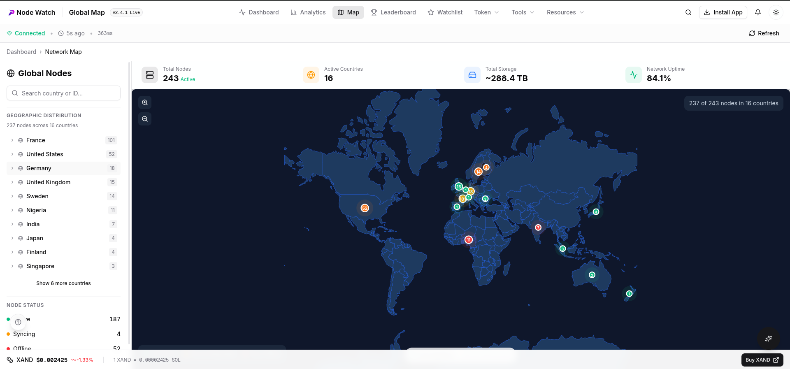
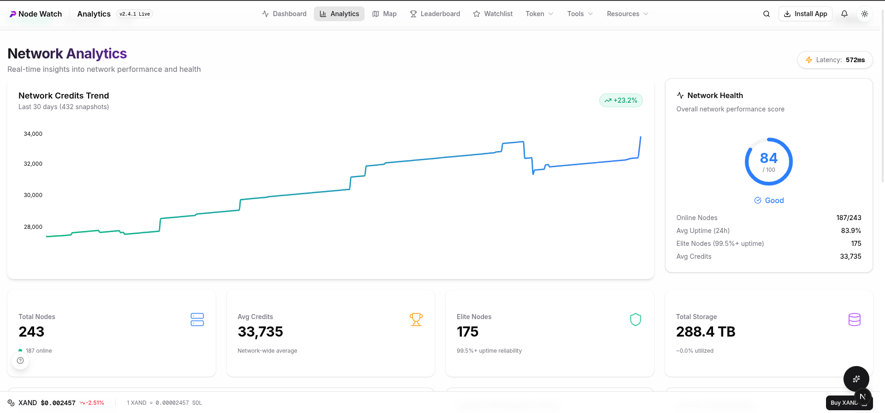
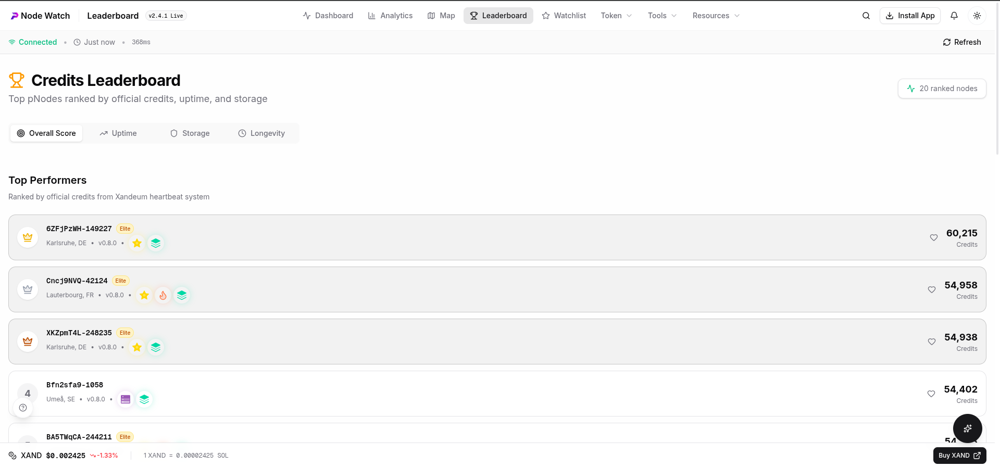

# Xandeum Analytics Dashboard (pNode Watch)
> **Note:** This is a community-built initiative to support Xandeum operators. It is **not** an official product of Xandeum Labs.


A comprehensive web-based analytics platform for monitoring and visualizing Xandeum's Provider Node (pNode) network in real-time.

## Visual Overview

| Dashboard | Network Map |
|-----------|-------------|
|  |  |

| Analytics | Leaderboard |
|-----------|-------------|
|  |  |

| Node Details | ROI Calculator |
|--------------|----------------|
|  |  |

## Quick Start

```bash
# Clone and install
git clone https://github.com/abulimen/xandeum-analytics.git
cd xandeum-analytics
npm install

# Configure environment
cp .env.example .env.local
# Edit .env.local with your settings

# Start development server
npm run dev
```

Open [http://localhost:3000](http://localhost:3000) in your browser.

## Documentation

| Document | Description |
|----------|-------------|
| [Architecture](docs/ARCHITECTURE.md) | System design, components, and data flow |
| [API Reference](docs/API.md) | Complete API documentation |
| [Development Guide](docs/DEVELOPMENT.md) | Setup, coding standards, and workflows |
| [User Guide](docs/USER_GUIDE.md) | Feature documentation for end users |
| [Deployment](docs/DEPLOYMENT.md) | Production deployment procedures |
| [Bot Setup](docs/BOTS.md) | Telegram & Discord bot configuration |

## Features

### Dashboard
- **Real-Time Monitoring** - Network health, total nodes, uptime, storage
- **Interactive Data Table** - Sort, filter, search nodes with status indicators
- **Auto-Refresh** - Data updates every 30 seconds

### Analytics
- **Time-Series Charts** - Network uptime trends, node counts, response times
- **Version Distribution** - Node software version breakdown
- **Version Distribution** - Node software version breakdown

### Map
- **Interactive World Map** - Geographic distribution with zoom/pan
- **Color-Coded Markers** - Green (online), yellow (degraded), red (offline)
- **Region Statistics** - Sidebar with country/city breakdown

### Leaderboard
- **Top Nodes by Uptime** - Highest availability with reliability badges
- **Top Nodes by Speed** - Fastest response times

### Alert System
- **Email Notifications** - Node offline, score drop alerts via Brevo
- **Browser Push** - Real-time notifications with service worker
- **Per-Node Subscriptions** - Subscribe to specific node events

### Tools
- **ROI Calculator** - Estimate pNode rewards with boost multipliers
- **Staking Calculator** - Calculate XANDSOL staking returns with real-time data
- **Trade XAND** - Integrated token trading interface
- **AI Copilot** - LongCat AI-powered assistant with real-time data access
- **Telegram Bot** - Network stats and alerts via Telegram
- **Discord Bot** - Slash commands for server integration
- **Tour Guide** - Interactive walkthroughs for all major pages
- **Node Comparison** - Compare up to 4 nodes side-by-side
- **Network Summary** - AI-generated health reports
- **Mobile Optimized** - Fully responsive design for all devices
- **PWA Ready** - Installable as a native app on iOS and Android

## Tech Stack

| Category | Technology |
|----------|------------|
| Framework | Next.js 14+ (App Router) |
| Language | TypeScript |
| Styling | Tailwind CSS + shadcn/ui |
| Charts | Recharts |
| Maps | react-simple-maps |
| State | TanStack Query (React Query) |
| HTTP | Axios, Fetch API |
| Database | Supabase (PostgreSQL) |
| Email | Brevo (Sendinblue) API |
| Push | Web Push (VAPID) |
| Token Data | Jupiter API |
| AI | Gemini / LongCat AI |

## Environment Variables

| Variable | Required | Description |
|----------|----------|-------------|
| `NEXT_PUBLIC_PNODE_SEED_IPS` | Yes | Comma-separated list of pNode seed IPs (e.g. `1.2.3.4,5.6.7.8`) |
| `SUPABASE_URL` | Yes | Your Supabase project URL |
| `SUPABASE_SERVICE_ROLE_KEY` | Yes | Supabase Service Role Key (Server-side admin) |
| `SUPABASE_ANON_KEY` | Yes | Supabase Anon Key (Client-side) |
| `BASE_URL` | Yes | Base URL of the app (e.g. `analytics.xandeum.network`) |
| `NEXT_PUBLIC_BASE_URL` | Yes | Public base URL (Client-side) |
| `GEMINI_API_KEY` | Yes | Google Gemini API Key for Copilot & Analysis |
| `LONGCAT_API_KEY` | Yes | LongCat API Key for Network Summaries |
| `JUPITER_API_KEY` | Yes | Jupiter API Key for XAND Price Data |
| `NEXT_PUBLIC_PNODE_RPC_PORT` | No | pNode RPC Port (Default: `6000`) |
| `NEXT_PUBLIC_PNODE_RPC_ENDPOINT` | No | pNode RPC Endpoint (Default: `/rpc`) |
| `CRON_SECRET` | No | Secret key to protect cron API endpoints |
| `BREVO_API_KEY` | No | Brevo (Sendinblue) API Key for Email Alerts |
| `ALERT_FROM_EMAIL` | No | Sender email for alerts |
| `ALERT_FROM_NAME` | No | Sender name for alerts |
| `NEXT_PUBLIC_VAPID_PUBLIC_KEY` | No | VAPID Public Key for Push Notifications |
| `VAPID_PRIVATE_KEY` | No | VAPID Private Key for Push Notifications |
| `VAPID_SUBJECT` | No | VAPID Subject (mailto link) |
| `TELEGRAM_BOT_TOKEN` | No | Telegram Bot Token |
| `DISCORD_APP_ID` | No | Discord Application ID |
| `DISCORD_PUBLIC_KEY` | No | Discord Public Key |
| `DISCORD_BOT_TOKEN` | No | Discord Bot Token |
| `GEMINI_MODEL` | No | Default: `gemini-2.0-flash` |
| `LONGCAT_API_URL` | No | Default: `https://api.longcat.chat/...` |

## Project Structure

```
xandeum-analytics/
├── app/                    # Next.js App Router pages
│   ├── api/                # API routes (prpc, alerts, etc.)
│   ├── analytics/          # Analytics page
│   ├── guide/              # User guide page
│   ├── leaderboard/        # Leaderboard page
│   ├── map/                # Geographic map page
│   ├── nodes/[id]/         # Node details dynamic route
│   └── page.tsx            # Dashboard home
├── components/
│   ├── alerts/             # Alert subscription components
│   ├── analytics/          # Chart components
│   ├── dashboard/          # Dashboard components
│   ├── layout/             # Header, Footer
│   ├── map/                # Map components
│   └── ui/                 # shadcn/ui components
├── hooks/                  # Custom React hooks
├── lib/
│   ├── db/                 # Supabase database layer
│   └── services/           # Business logic services
├── types/                  # TypeScript definitions
└── docs/                   # Documentation
```

## Scripts

```bash
npm run dev      # Start development server
npm run build    # Build for production
npm start        # Start production server
npm run lint     # Run ESLint
```

## License

MIT License - see LICENSE file for details.

---

Built with ❤️ for the Xandeum Network
